# AnchorBoard-SaaS

<p align="center">
  
  
  
  
  
  
</p>

<p align="center">
  <strong>Multi-tenant SaaS project management: Kanban boards, JWT auth, real teammate assignment, and event-driven notifications</strong><br/>
  5 Spring Boot microservices · Kafka event pipeline · Next.js 16 dashboard
</p>

<p align="center">
  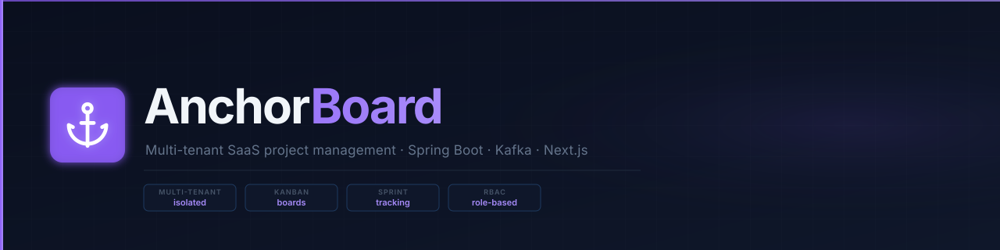
</p>

AnchorBoard-SaaS is a multi-tenant project management platform: sign up or log in, create projects, track tasks on a Kanban board, assign them to a real teammate, and get notified (by toast, notification bell, and real email) when work is assigned to you or its status changes. It's built as five independent Spring Boot services (auth, projects/tasks, notifications, gateway, common library) behind a Next.js 16 dashboard, with Kafka carrying events between services rather than a shared in-process event bus.

## Screenshots

<table align="center">
  <tr>
    <td align="center" width="20%"><sub>Login</sub></td>
    <td align="center" width="20%"><sub>Dashboard</sub></td>
    <td align="center" width="20%"><sub>Projects</sub></td>
    <td align="center" width="20%"><sub>Project detail + assignment</sub></td>
    <td align="center" width="20%"><sub>Task Board</sub></td>
  </tr>
  <tr>
    <td align="center" width="20%">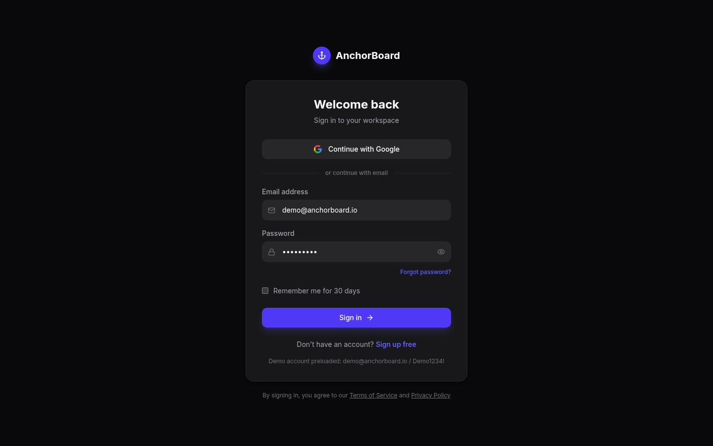</td>
    <td align="center" width="20%">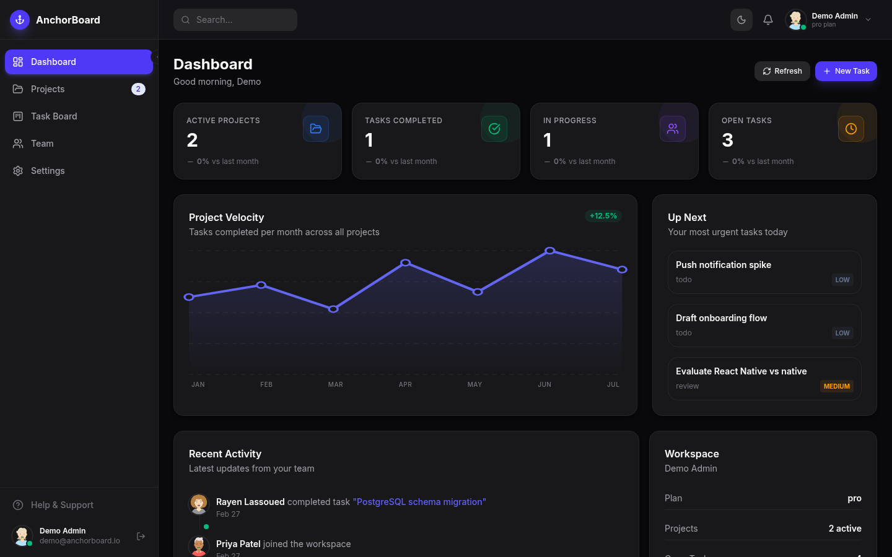</td>
    <td align="center" width="20%">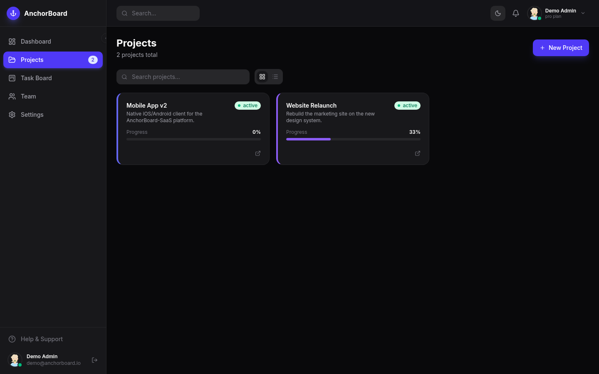</td>
    <td align="center" width="20%">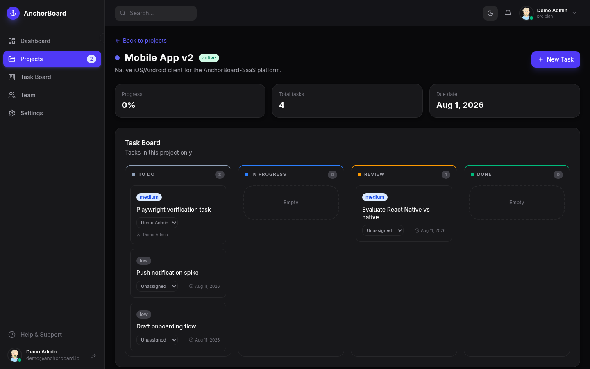</td>
    <td align="center" width="20%">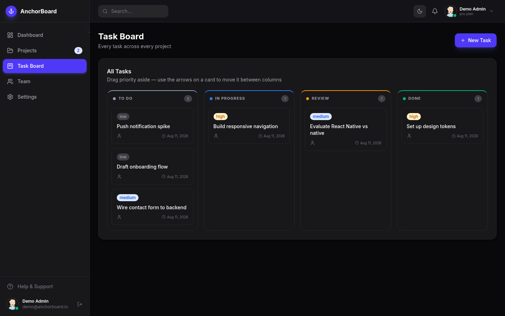</td>
  </tr>
  <tr>
    <td align="center" width="20%"><sub>Notifications</sub></td>
    <td align="center" width="20%"><sub>Interactive chart</sub></td>
    <td align="center" width="20%"><sub>Profile settings</sub></td>
    <td align="center" width="20%"><sub>Security settings</sub></td>
    <td align="center" width="20%"><sub>Billing (honest state)</sub></td>
  </tr>
  <tr>
    <td align="center" width="20%">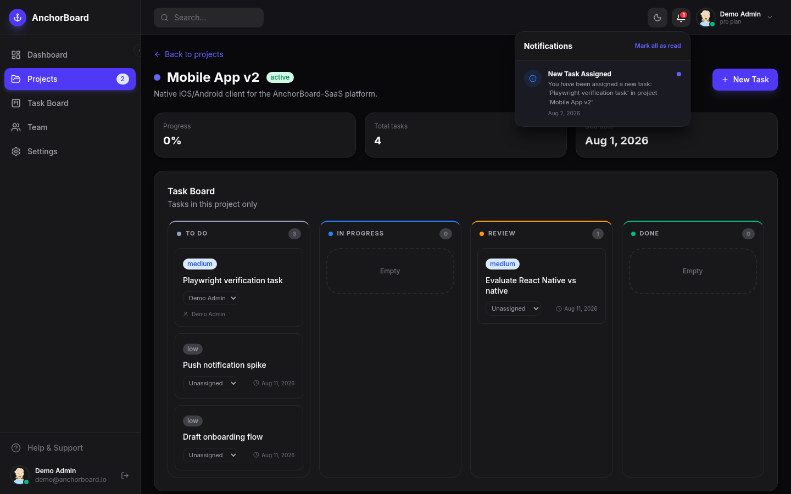</td>
    <td align="center" width="20%">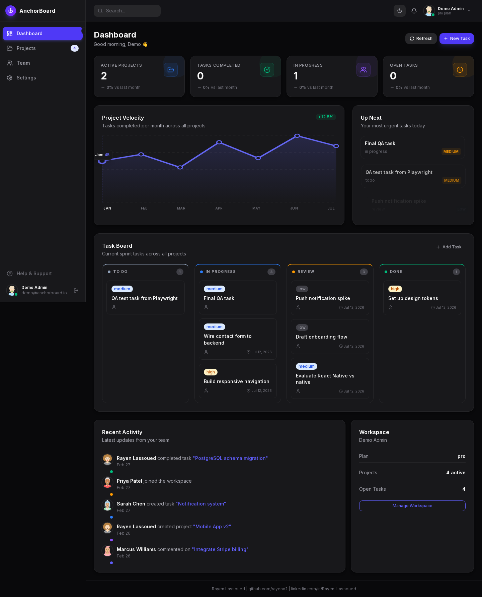</td>
    <td align="center" width="20%">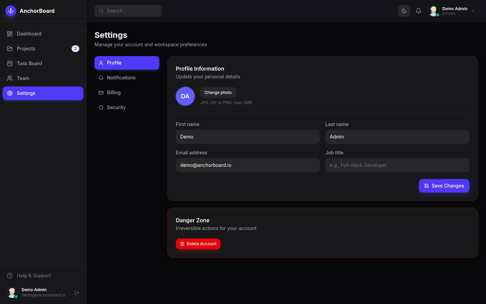</td>
    <td align="center" width="20%">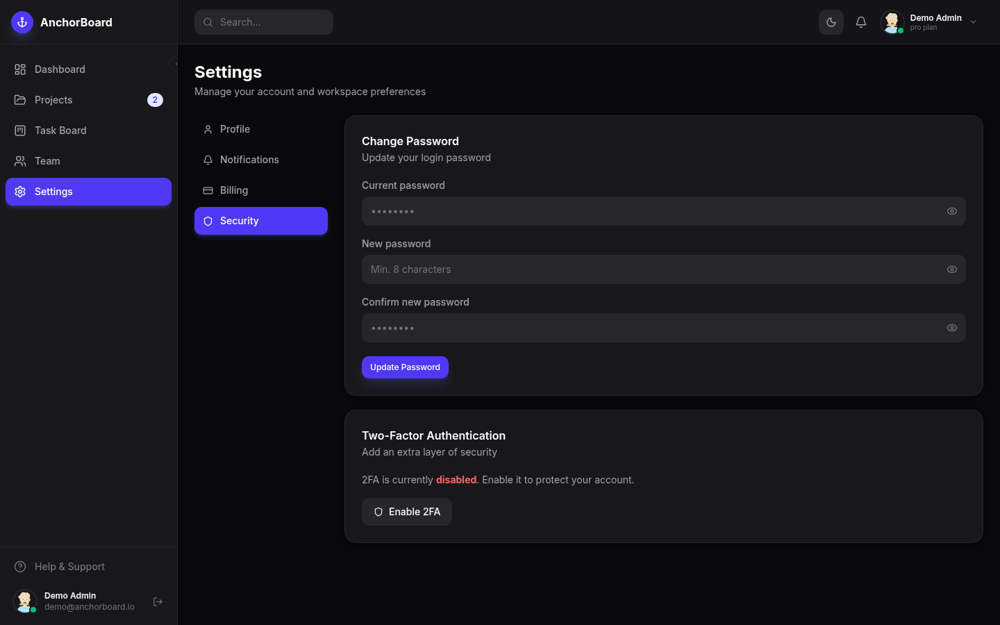</td>
    <td align="center" width="20%">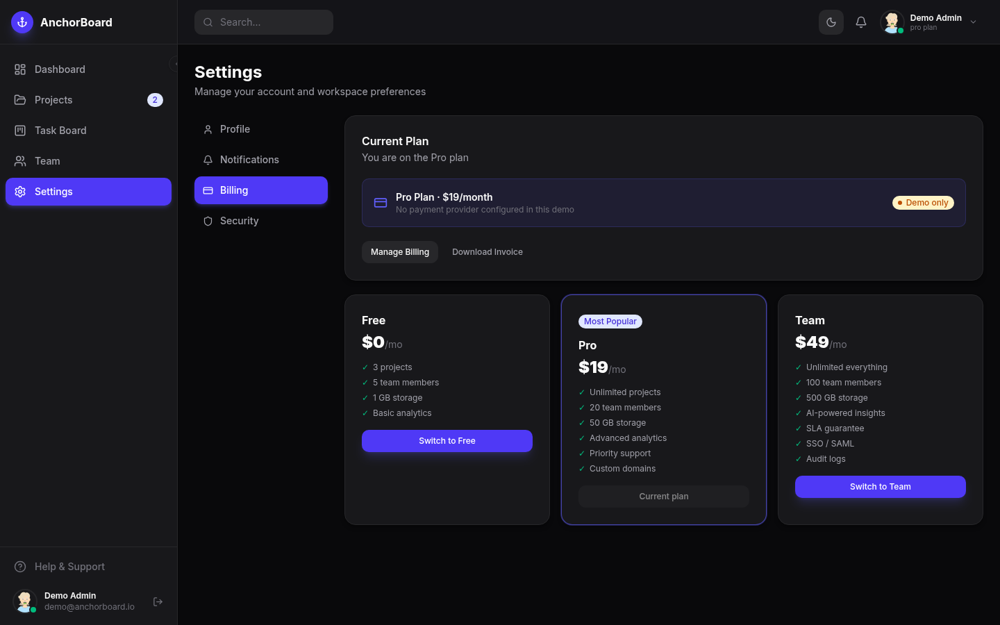</td>
  </tr>
</table>

## Live Demo

**Live:** [https://anchorboard-demo.vercel.app](https://anchorboard-demo.vercel.app)

## Architecture

<p align="center">
  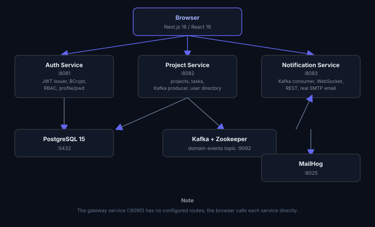
</p>

The `gateway` service (:8090) has no configured routes: the browser calls each service directly on its own port instead. See [Honest limitations](#honest-limitations).

## How It Works

1. A user logs in or signs up against auth-service, which issues a short-lived JWT (BCrypt-verified password, HS256-signed, 15-minute expiry) plus a refresh token; the frontend silently refreshes it on expiry so a long session never gets kicked to the login screen mid-use
2. Every subsequent request carries that JWT and an `X-Tenant-ID` header; project-service and notification-service each validate the signature independently (no shared session store) before running any role check
3. Creating a project, assigning a task to a real teammate (looked up via `GET /api/users`), or changing a task's status calls the real project-service REST API, which persists to Postgres and publishes a domain event (`project.created`, `task.assigned`, `task.status.changed`) to the Kafka topic `domain-events`
4. notification-service consumes that topic, creates a `Notification` row, sends a real email through MailHog (viewable at `:8025`), and pushes the notification over WebSocket and a pollable REST endpoint
5. The dashboard polls `/api/notifications` every 8 seconds and surfaces new ones as toasts and in the notification bell; clicking one marks it read and navigates to the project it belongs to
6. Every project has its own detail page with a task board scoped to just that project; the global Task Board page shows every task across every project
7. The Kanban board's drag/move-left/move-right actions call `PATCH /api/tasks/{id}/status` directly: moving a card is a real state transition, not a local-only UI change

## Tech Stack

| Layer | Technology | Notes |
|---|---|---|
| Backend | Java 21, Spring Boot 3.2 | 5 Maven modules: auth-service, project-service, notification-service, gateway, common-lib |
| Auth | Spring Security, JJWT (HS256), BCrypt | Each service validates JWTs independently against a shared secret |
| Event streaming | Apache Kafka + Zookeeper | project-service produces, notification-service consumes |
| Real-time push | Spring WebSocket + STOMP/SockJS | notification-service's `/ws-notification` endpoint |
| Email | Spring Mail + MailHog | Real SMTP delivery to a local catcher, no external provider needed |
| Database | PostgreSQL 15 | Multi-tenant via a `tenant_id` column, Hibernate `ddl-auto: update` |
| Frontend | Next.js 16, React 19, TypeScript, TailwindCSS, Framer Motion | App Router, React Query for server state |
| Deployment | Docker Compose | 10 services: postgres, zookeeper, kafka, mailhog, auth/project/notification-service, gateway, frontend |

## Quick Start

```bash
git clone git@github.com:Hamilas/AnchorBoard.git
cd AnchorBoard
docker compose up -d --build   # first build compiles 5 Maven modules, ~5-10 min
```

| Service | URL |
|---|---|
| Frontend | http://localhost:3000 |
| Auth API | http://localhost:8081/auth/api |
| Project/Task API | http://localhost:8082/api |
| Notification API | http://localhost:8083/api |
| Sent emails (MailHog) | http://localhost:8025 |

Log in with the preloaded demo account: **demo@anchorboard.io / Demo1234!**, or create a new account from the sign-up page (new accounts get the `PROJECT_MANAGER` role automatically).

`docker-compose.dev.yml` starts only Postgres/Redis + the frontend for a fast UI-only preview (no Maven build): the frontend will show connection errors for API calls since no backend is running in that mode.

## Features

**Real, backed by the running services:**
- JWT login and self-service registration, with silent token refresh and a demo account seeded on first boot
- Multi-tenant project and task CRUD, including a per-project detail page with its own scoped task board and a global Task Board across all projects
- Tasks can be assigned to any real teammate (`GET /api/users`), not just the current user
- Task status transitions enforced server-side (e.g. a `DONE` task can't jump back to `TODO`)
- A task assignment or status change publishes a real Kafka event, consumed by notification-service, which creates a notification delivered over WebSocket, a polling REST endpoint, and real email (MailHog)
- Notification bell with unread count; clicking a notification marks it read and navigates to the relevant project
- Profile editing (name, job title, photo) and password change, both persisted for real via auth-service
- Dashboard KPIs and per-project progress bars are computed from real data, not hardcoded
- Team page lists the tenant's real user directory (`GET /api/users`), and project cards resolve real teammate names/avatars the same way
- Dashboard stat cards are clickable and route to the relevant page

**Explicitly not real, and labeled as such in the UI rather than silently doing nothing:**
- Billing/invoices: no payment provider is configured; those buttons show an in-app message explaining why
- Two-factor authentication and account deletion, same honest "not available" treatment

## API Endpoints

| Service | Method | Path | Description |
|---|---|---|---|
| auth-service | POST | `/auth/api/auth/login` | Log in, returns access + refresh tokens |
| auth-service | POST | `/auth/api/auth/register` | Self-service signup, auto-logs in |
| auth-service | POST | `/auth/api/auth/refresh` | Exchange a refresh token for a new access token |
| auth-service | GET | `/auth/api/users` | Tenant's user directory (for task assignment) |
| auth-service | GET/PUT | `/auth/api/users/me` | View / update your own profile |
| auth-service | PUT | `/auth/api/users/me/password` | Change your password |
| project-service | GET/POST | `/api/projects` | List / create projects (paginated) |
| project-service | GET/POST | `/api/tasks` | List / create tasks |
| project-service | GET | `/api/tasks/project/{projectId}` | Tasks for a single project |
| project-service | PATCH | `/api/tasks/{id}/status` | Change task status (publishes `task.status.changed`) |
| project-service | PATCH | `/api/tasks/{id}/assign` | Assign a task (publishes `task.assigned`) |
| notification-service | GET | `/api/notifications` | Notifications for the authenticated user |
| notification-service | PATCH | `/api/notifications/{id}/read` | Mark one notification as read |
| notification-service | PATCH | `/api/notifications/read-all` | Mark all as read |

All project-service and notification-service requests require an `Authorization: Bearer <token>` header; project-service also requires `X-Tenant-ID`.

## Honest limitations

- **Gateway has no routes.** It's a Spring Boot app with the Spring Cloud Gateway dependency present but no route configuration: the frontend calls auth/project/notification-service directly on their own ports rather than through a single origin.
- **Email goes to MailHog, not the real internet.** It's a local SMTP catcher (view sent mail at `:8025`) standing in for a real provider; nothing is delivered to actual inboxes.
- **Billing has no backend.** The Settings → Billing tab is UI-only; every action there explains that no payment provider is configured instead of pretending to work.
- **Dashboard "Recent Activity" feed and the velocity chart are example data**, not computed from real events yet (tasks don't carry a completion timestamp today, only `createdAt`).
- **Team invites are UI-only.** There's no invite-by-email endpoint; the member list itself is real, but new teammates currently join by registering their own account against the tenant.
- **Flyway is present as a dependency but disabled** (`spring.flyway.enabled: false`); schema is managed by Hibernate's `ddl-auto: update` instead.

## Author
**Akash Singh**
[github.com](https://github.com/akashhsingh1906-lab?tab=repositories) | [LinkedIn](https://www.linkedin.com/in/akash-singh-925446418/)
